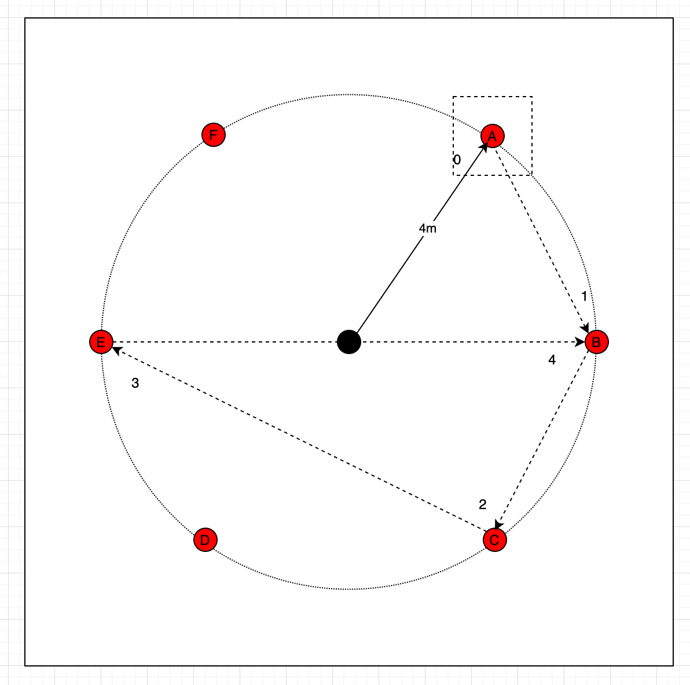
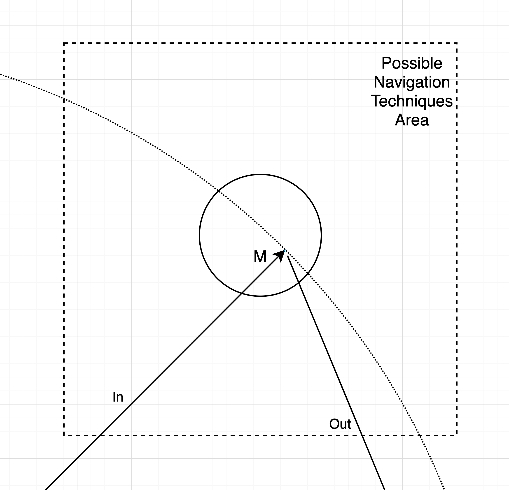

# Test Plan
The test plan imitates the user study in `NaviField`, however, our experiment and paper invastigation will only focusing on navigation scaling without considering visual perspective. The test plan will cover the **Travelling Task** and its metrics.

## User Study Design
We here will exam two methods, specifically **Lattice Crushing** and **ChoiField**, and it use homogeneous scaling as the baseline. The experiment will have two perspective:
* Compare with each other to figure out the advantages and their disadvantages
* Compare each of them against homogeneous scaling as the metrics
* Possibly integrate `NaviField` implementation in the framework

## Test Environment & Task
The environment should be similar to the `NaviField` one as the following figure suggested: 
|Overall (Fig. 1)| Flag (Fig. 2)|
|-------|-----|
|||

The image demonstrate a regular hexagon position for 6 flags. The bot will start at the centre of the environment. Then one of the flag will ramdomly highlighted by the system, so that bot will navigate to the direction as the figure marking it as movement 0. 

Figure 1 shows a five flag case of the bot moving path. The number on the dashed line shows the possible moving routes (1-4 in our case); Figure 2 shows a detail scaled-in image where it is applied to the our two navigation techniques. The point M here is a random point in the technique area (No need to be at centre), to see the outcome of the virtual path.

## Experimental Design
As stated in the first section, we compared the two navigation methods (NEW)s to the homogenenous scaling(BASE). We have 3 sets of factors:
* Test condition (T): NEW vs. BASE.
* Scaling factors (S): 2, 4, 8
* travelling path (L): 3, 5 -> Number of flag the bot should reach, within the same distances

N.B. We do not need the natral walking since the computer simulator program cannot have deviations to the real walking scenario.

## Metrics
The following variable are recorded by the test script:
* Angle difference `T_AD`: The angle difference on each bot moving frame
* Scaling factor `T_SF`: The scaling factor on each bot moving frame
* Task completion time `T_TCT`: The time since the paticipants arrived to the first flag until they reached the final flag.
* Real distance travelled `T_RD`: The distance bot travelled in the real world
* Deviation `T_D`: Ratio between length of the virtual trajectory followed divided by the optimum path length (straight line)

