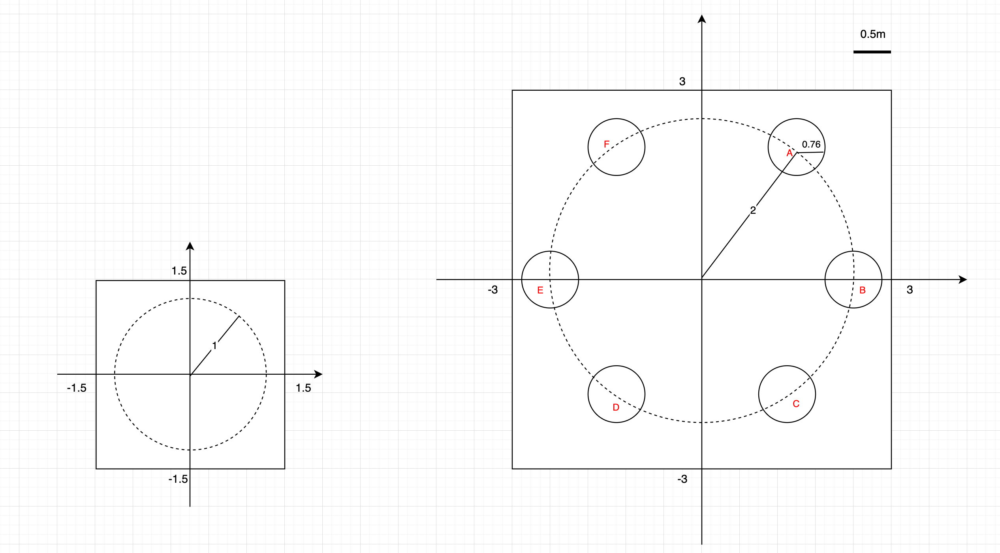
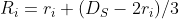
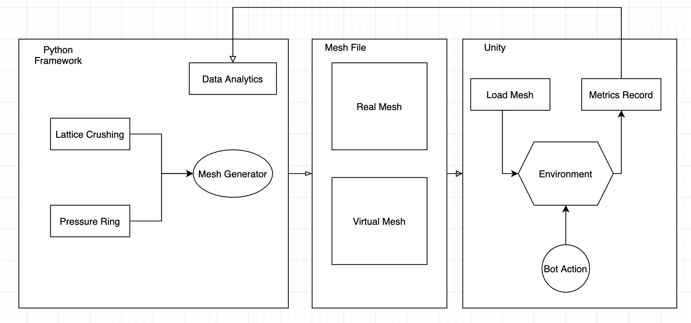

# Test Plan
The test plan imitates the user study in `NaviField`, however, our experiment and paper invastigation will only focusing on navigation scaling without considering visual perspective. The test plan will cover the **Travelling Task** and its metrics.

## User Study Design
We here will exam two methods, specifically **Lattice Crushing** and **Pressure Ring**, and it use homogeneous scaling as the baseline. The experiment will have two perspective:
* Compare with each other to figure out the advantages and their disadvantages
* Compare each of them against homogeneous scaling as the metrics
* Possibly integrate `NaviField` implementation in the framework

## Test Environment & Task
The environment should be similar to the `NaviField` one as the following figure suggested: 
|Overall (Fig. 1)| Flag (Fig. 2)|
|-------|-----|
|||

The image demonstrate a regular hexagon position for 6 flags. The bot will start at the centre of the environment. Then one of the flag will ramdomly highlighted by the system, so that bot will navigate to the direction as the figure marking it as movement 0. 

Figure 1 shows a five flag case of the bot moving path. The number on the dashed line shows the possible moving routes (1-4 in our case); Figure 2 shows a detail scaled-in image where it is applied to the our two navigation techniques. The point M here is a random point in the technique area (No need to be at centre), to see the outcome of the virtual path.

We will also consider about the actual movement of a human user, i.e. human will have an initial speed and acceaccelerate to some certian speed, and they will gradually decrease the speed to zero when they reach the flag.

## Experimental Design
As stated in the first section, we compared the two navigation methods (NEW)s to the homogenenous scaling(BASE). We have 3 sets of factors:
* Test condition (T): NEW vs. BASE.
* Scaling factors (S): 2 
* travelling path (L): 3, 5 -> Number of flag the bot should reach, within the same distances

N.B. We do not need the natral walking since the computer simulator program cannot have deviations to the real walking scenario.

## Mesh Design & Format
It is stored in `JSON` format for simplicity, since we have the clone of the `python` framework in Unity already, it would be good we just dump and transform the data directly and deserialize it into `C#` objects.

The setup would be display as follows:
<div style="text-align:center">
    
</div>

The origin is placed at the centre of the mesh, where the bot start moving. The virtual size would be 6 * 6 for enough safe area. The flags will be evenly spaced at the circle with radius of 2 (Right Figure). As discussed above the the scaling factor is 2 on homogenous scaling at non-relavent area, the real mesh dimension would be 3 * 3, the radius would be 1 in our case (Left Figure).

The radius is calculated by:
<div style="text-align:center">
    
</div>
where  is the radius of the outer circle and  is the radius inner circle according to `NaviField`. We here assume that all scaling & relavent area should be in the outer circle, hence we could get  as the figure above suggested.

Hence we could have the list of coordinates as follows:
,
,
,
,
,
,


The data format would be:
```
{
   "verts":[
      [5.0,5.0],
      [5.0,-5.0],
      [-5.0,-5.0],
      [-5.0,5.0]
   ],
   "tInd":[
      [0,1,3],
      [1,2,3]
   ]
}
```
This example shows the real mesh with homogenous scaling. `"verts"` represents the mesh vertex in 2D space, and `"tInd"` stands for triangle index ([reference 1](gradientspace.com/tutorials/dmesh3) and [reference 2](http://gamma.cs.unc.edu/COMP770/LECTURES/11trimesh.pdf))
## Metrics
The following variable are recorded by the test script:
* Angle error `T_AD`: The absolute angle difference between the virual and the actual direction on each bot moving frame.
* Scaling factor `T_SF`: The scaling factor on each bot moving frame
* Task completion time `T_TCT`: The time since the paticipants arrived to the first flag until they reached the final flag.
* Real distance travelled `T_RD`: The distance bot travelled in the real world
* Deviation `T_D`: Ratio between length of the virtual trajectory followed divided by the optimum path length (straight line)

## Analytics
* Scaling factor against real distance within relavent area: The scaling factor integrating across real distance
    <div style="text-align:center">
    
    </div>
* Maximum absolute changing gradient of scaling factor()
    <div style="text-align:center">
    
    </div>
* Angle difference against real distance within relavent area: The
angle difference integrating across real distance
    <div style="text-align:center">
    
    </div>
* Angle difference against real distance for all distance: The
angle difference integrating across real distance
    <div style="text-align:center">
    
    </div>
* Maximum absolute changing gradient of angle difference()
    <div style="text-align:center">
    
    </div>

## Acutal Implementation
The task allocation can be devided into two parts: *Mesh Generation* and *Test Environment*
* **Mathematica Team**:
    * Theory of two method, reasonable language desctiption
    * Generate Mesh for real and virtual
* **Unity Team**:
    * Implement a test environment as above mentioned
    * Only need to able to load the meshes, do not need to implement the actual method
    * Capture the metrics

<div style="text-align:center">
    
</div>